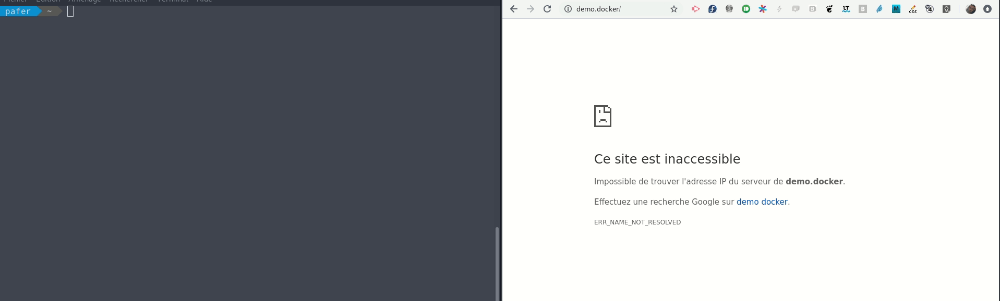

# Docker container DNS entry with NetworkManager and dnsmasq

This service configure dnsmasq over NetworkManager and systemd-resolved configuration if it's activated. It will allow you to locally resolve container hostnames and/or names.

Then use `example.docker`.

TL;DR It creates DNS entries to contact your containers:

```
docker run --hostname="webapp.docker" nginx:alpine
# Then go to http://webapp.docker and voilà!

# and more...
```

It also can parse traefik labels to get router http domain. Note that ".localhost", ".local" or ".localdomain" are **always** resolved from `/etc/hosts` so that dnsmasq will not be used and `127.0.0.1` wil be used. You need to add a domain for real docker IP. E.g.:

```
traefik.http.routers.nginx.rule=Host(`example.local`, `example.docker`)
```



This service is **not made for production servers, this is a tool for users on local computer**.

Please, read the entire README file, it's important to resolve possible problems, and to make configuration to fit your needs.

You will be able to resolve:

- hostnames given to the containers (all .docker by default, but you can change that)
- containername.networkname for docker network, eg. with docker-compose, excepting for the "bridge" network that is the default network

You can change options in `/etc/docker/docker-auto-dns.conf` file created by the Makefile.

# Table of contents

* [Docker container DNS entry with NetworkManager and dnsmasq](#docker-container-dns-entry-with-networkmanager-and-dnsmasq)
* [Table of contents](#table-of-contents)
* [Requirements](#requirements)
* [Update from outdated version](#update-from-outdated-version)
* [Installation](#installation)
   * [I don't trust you, I want to do it manually](#i-dont-trust-you-i-want-to-do-it-manually)
   * [Automatic Installation](#automatic-installation)
      * [The basic and standard installation](#the-basic-and-standard-installation)
      * [If you don't use the same network, docker interface name, and so on... than the standard](#if-you-dont-use-the-same-network-docker-interface-name-and-so-on-than-the-standard)
   * [Install with specific domains filter](#install-with-specific-domains-filter)
   * [Now try with your own container!](#now-try-with-your-own-container)
   * [Configuration after installation](#configuration-after-installation)
* [Uninstall](#uninstall)
* [Fixing problems](#fixing-problems)
   * [I uninstalled the service and now Docker fails to restart](#i-uninstalled-the-service-and-now-docker-fails-to-restart)
   * [Installation freeze when detecting the dnsmasq IP Address](#installation-freeze-when-detecting-the-dnsmasq-ip-address)
* [Behind the scene](#behind-the-scene)
* [What about Traefik](#what-about-traefik)
* [FAQ](#faq)
   * [What about windows ? Mac OS ?](#what-about-windows--mac-os-)
   * [I want to resolve xxx.localhost, it doesn't works](#i-want-to-resolve-xxxlocalhost-it-doesnt-works)
   * [What if my container is listening on another port than 80 or 443 ?](#what-if-my-container-is-listening-on-another-port-than-80-or-443-)
   * [I want to use certificate](#i-want-to-use-certificate)
* [Is this Better/Worse than docker-listen?](#is-this-betterworse-than-docker-listen)
* [Give me a hand](#give-me-a-hand)
* [Future](#future)
* [License](#license)


# Requirements

To install docker-auto-dns, you only need that requirements:

- You need Python3
- NetworkManager
- A Linux distribution using Systemd (with or without systemd-resolved)
- You need "docker" python SDK - this is a standard package, please use your distribution package manager to install "python3-docker"
```
# fedora
sudo dnf install python3-docker
# centos
sudo yum install python3-docker
# ubuntu/debian
sudo apt install python3-docker
```
- You really need to know what you do! Even if that project should not break anything, it's important to know that we are not responsible for problems that may happen on your computer. Keep in mind that we will add a service, and we will need to open one port. So, check twice what you do.

# Update from outdated version

Older versions use "docker-dns" name for service and configuration file. You should use:

```bash
make uninstall SERVICENAME="docker-dns"
```

That will rename old service name and configuration to the newer standard, and you will be ready to update the service without any problem.

# Installation

## I don't trust you, I want to do it manually

Right, you prefer to do it manually, no problem.

- First step, activate "dnsmasq" in NetworkManager configuration. You only have to create a file named `/etc/NetworkManager/conf.d/dnsmasq.conf` containing:
```
[main]
dns=dnsmasq
```

And say to `dnsmasq` (not the global one, only the NetworkManager one) to listend on "lo" and "docker0" interfaces in `/etc/NetworkManager/dnsmasq.d/docker-auto-dns-interface.conf`
```
interface=lo,docker0
```

Then reload: `sudo systemctl condrestart NetworkManager`. 

> Your connection will be reset (so you will lose network connection for a few seconds).

> Step 1 done, NetworkManager now use dnsmaq in addition to your others DNS servers


- Then install `docker-auto-dns` service and script

It's now time to install the automatic DNS creator (this project).

First, set `/etc/docker/docker-auto-dns.conf` file with this (optionnal):
```
# restrict domains, it's comma separated and you must add a dot for each domains
# e.g. .docker,.container,.foo
DOCKER_DOMAIN=.docker
# use resolution in docker containers too
DOCKER_RESOLVE_NAME=true
```

Then copy `docker-auto-dns.service` to `/etc/systemd/system/docker-auto-dns.service` and edit to replace `INSTALL_PATH` to `/usr/local/libexec`. 

```bash
sudo cp ./docker-auto-dns.service /etc/systemd/system/
sudo sed -i 's,INSTALL_PATH,/usr/local/libexec,g' /etc/systemd/system/docker-auto-dns.service
```

This is the content I use:
```
[Unit]
Description=Docker containers DNS entries in dnsmasq for NetworkManager

After=docker.service
Requires=docker.service

After=NetworkManager.service
Requires=NetworkManager.service
 
[Service]
Type=simple
EnvironmentFile=-/etc/docker/docker-auto-dns.conf
ExecStart=/usr/bin/python3 /usr/local/libexec/docker-auto-dns.py
Restart=on-failure
 
[Install]
WantedBy=multi-user.target
```

Copy the `./docker-auto-dns.py` file to `/usr/local/libexec/`.

```bash
sudo cp ./docker-auto-dns.py /usr/local/libexec
```

- Activate the service by `systemctl start docker-auto-dns`

That's all!

You can see the log:

```
journalctl -xen -f -u docker-auto-dns
```

Check [this section)[#firewall-consideration] if you have some problem to access domain **from** docker containers.

## Automatic Installation

The provided Makefile can make the full required installation. There are options to affine your needs.

### The basic and standard installation

This is what I recommend to use. It activates resolution for

- all `.docker` domains
- `containername.networkname` for container that are running in a "docker network" excepting the default one that is named "bridge"

```bash
sudo make install activate
```

> Don't forget to "activate" the service, this is done in above command. You can also do it with `sudo systemctl start docker-auto-dns`.

This Makefile command will configure NetworkManager to use dnsmasq entries, use "docker0" interface in addition to make dnsmasq to respond to containers, it will also add the dnsmasq IP in DNS list for systemd-resolved if you're using it.

Then it installs docker-auto-dns service on the system and "activate" starts the service. 

> You can now resolve container hostnames.

### If you don't use the same network, docker interface name, and so on... than the standard

You can change several options, here the default values:

```bash
make install activate DOCKER_IFACE=docker0 DOCKER_CIDR=172.0.0.0/8
```

> Don't forget to "activate" the service, this is done in above command. You can also do it with `sudo systemctl start docker-auto-dns`.

Others options are listed in next sections.

## Install with specific domains filter

If you want to filter others domains than ".docker", you may give the `DOMAINS` option to specify comma separated domains names:

```bash
sudo make install activate DOMAINS=".docker,.dck,.foo,.with.dots"
```

> Don't forget to "activate" the service, this is done in above command. You can also do it with `sudo systemctl start docker-auto-dns`.

If you want to let dnsmasq resolving all domain names, you can set the `DOMAIN` value as *empty string* - note that the entire docker containers will add DNS entry with their hostname if you provide one

```bash
sudo make install activate DOMAINS=""
```

> Don't forget to "activate" the service, this is done in above command. You can also do it with `sudo systemctl start docker-auto-dns`.

You can also change the filtering in `/etc/docker/docker-auto-dns.conf` and change `DOCKER_DOMAIN` variable, then restart the "docker-auto-dns" service.


## Now try with your own container!

This will explain how you can now use hotnames for containers.

```bash
docker run --name demo --rm -d --hostname="example.docker" nginx:alpine
curl -s example.docker
# you should see the nginx standart page output
# then stop the container
docker stop demo
```

With docker networks, it also very simple:
```bash
docker network create mydomain
docker run --rm -d --name website --network mydomain nginx:alpine
# and now contact the container
curl -s website.mydomain

# then remove container and network
docker stop website
docker network rm mydomain
```

You can also take a look on [examples](./examples) with docker-compose to take advantage on domain name resolution.

## Configuration after installation

You can edit `/etc/docker/docker-auto-dns.conf` file and adapt options. 

To change the domain to resolve, it's a coma separated list, without space:

```
DOCKER_DOMAIN=.other.domain
```

# Uninstall

You can remove the service with:

```bash
sudo make uninstall
```

It removes NetworkManager dnsmasq configuration, stop the docker-auto-dns service and removes it.

If you want to remove the firewall rules on `firewalld`, please use:

```bash
make uninstall-firewall-rules
```

That removes the "docker" zone where "docker0" interface resides, so docker0 is now in the default zone.

Everything should now be back to the normal.

# Fixing problems

## I uninstalled the service and now Docker fails to restart

This is something that can sometimes happen on Fedora. It seems that "moby-engine" wants to move the `docker0` interface in a firewalld zone that is not correct. So, what you can do is to move `docker0` interface to `docker` zone if it exists.

This commands can works, either use `firewall-config` graphical interface, right click on the zone where `docker0` should be and add it inside the zone (commonly, we use a `docker` zone, create it if needed).

```bash
_ZONE=$(for z in $(sudo firewall-cmd --get-zones ); do sudo firewall-cmd --list-interfaces --zone=$z | grep "docker0" 2>&1 >/dev/null && echo "$z"; done)
if [ -n "$_ZONE" ]; then
    sudo firewall-cmd --remove-interface=docker0 --zone=$_ZONE
    sudo firewall-cmd --add-interface=docker0    --zone=docker
else
    echo "Zone not found for docker0 interface"
fi
unset _ZONE
```

Then `sudo systemctl restart docker` should work.

## Installation freeze when detecting the dnsmasq IP Address

In this (unusuall) case, you can press `CTRL+C` and restart `sudo make install`. This happens when NetworkManager fails to start dnsmasq. The problem rarely occurs but if you find why... Pull Request please!

# Behind the scene

**What does docker-auto-dnsmasq?**

NetworkManager can use dnsmasq if we set the configuration `dns=dnsmasq`. In this case, a `dnsmasq` service is started for the current connection. The `Makefile` first installs this configuration in `/etc/NetworkManager/conf.d/dnsmasq.conf` file.

Newest Linux distrubution has got `resolved` service to adapt your configuration. To make it using the right DNS (dnsmasq), we need to create a `/etc/systemd/resolved.conf.d/dnsmasq.conf` to tell it that it must listen on "lo" and "docker0" interfaces.

Then we can reload NetworkManager and resolved. This started a "specific" dnsmasq service for NetworkManager.

Afterward, the `docker-auto-dns.py` file is placed in your system and a service named `docker-auto-dnsmasq` service is installed. This scripts listens the Docker events to know when a container is started or stopped.

For each running container, the script build a domain name string, and add the configuration in `/etc/NetworkManager/dnsmasq.d/docker-auto-dns.conf` file. For example: `address=/foo.docker/172.17.0.4`. Then the scripts refresh the DNS cache to make `foo.docker` address resolvable by you and your containers.

So:

- You don't need to bind ports because the domain name points on the container IP
- To avoid problems, the script also binds `NAME.NETWORKNAME`
- You can, of course, set `hostname` to the container, this name will be set in addition

# What about Traefik

Traefik is a very strong, easy to use and famous http front-end that can be used as http reverse proxy to you containers. You need to set labels on your containers to indicate the hostname to use, then Traefik will automatically send connectins (with load-balancing) to the endpoint.

> That's cool, but...

- Traefik may have trouble when you "switch" HTTP headers (some user wants to use Varnish and activate or not the backend).
- It's possible that packets are added or modified - remember it is a "reverse proxy"
- You may lose Websocket connexion sometimes
- You need a "lot" of configuration to adapte TLS/SSL
- On standard Linux (so... not on Ubuntu...) you must launch Traefik as root because you cannot bind port 80/443 as standard user...
- and you may have conflicts with already started services listening these ports...
- you must touch `/etc/hosts` to indicate all your domains as soon as you're not using `XXX.localhost`

Well, Traefik is very interesting and can work on a lot of OS.

Don't panic, Docker-Auto-DNS can use traefik labels so your teamate docker-compose files will, theorically works (if your containers listen 80/443, it's transparent).

> Docker-Auto-DNS is not a replacement of Traefik, it's a **lighter** way to use "real domains" and avoid http routers. It's faster (because you only resolve domain), and you can test your project with "production domain name" (e.g. I can launch a container this way: `docker run --rm --hostname google.com nginx`).

# FAQ

## What about windows ? Mac OS ?

Work in progress

## I want to resolve xxx.localhost, it doesn't works

Linux always uses `/etc/hosts` in priority, so the `.localhost` domain is always resolved to `127.0.0.1`. We cannot change this behavior.

## What if my container is listening on another port than 80 or 443 ?

Docker-Auto-DNS only resolve domains. If your container is listening on port 8080 for example, you'll need to add the port to the domain when you request your website on a web browser. If you cannot change the listening port, use a reverse proxy container (as it's recommended in any web application) like Nginx or Apache-httpd. Make this container hostname to the desired domain name. And make the reverse proxy pointing on your container (name) port. That's "the state of the art".

## I want to use certificate

It's simple as a pie...

First, use `mkcert -install` to create a local certificate and to make your browsers to be able to accept it. Then create a configuration to use your certificates. For example with Nginx

```
DOMAIN="foo.docker"
mkdir -p webserver/{certs,conf}
mkcert -install -cert-file webserver/certs/$DOMAIN.crt -key-file webserver/certs/$DOMAIN.key $DOMAIN
unset DOMAIN

# in webserver/conf/default.conf
server {
    listen :443;
    ssl on;
    ssl_certificate         /etc/nginx/certs/foo.docker.crt;
    ssl_certificate_key     /etc/nginx/certs/foo.docker.key;
}

# mount webserver/cert to /etc/nginx/certs and webserver/conf to webserver/conf.d
services:
    myapp:
       image: nginx
       volumes:
       - ./webserver/conf:/etc/nginx/conf.d:z
       - ./webserver/certs:/etc/nginx/certs:z
```

To remove certificates from your store:

```
mkcert -uninstall foo.docker
```


# Is this Better/Worse than docker-listen?

I already used docker-listen years ago. That works, yes.

There is not so many differences. 

The current project, this one, named docker-auto-dns, acts on NetworkManager capabilities to use dnsmasq. That's not exactly what does docker-listen. You probably prefer the other project.

I just prefer the way I manage dns entries, how I can activate the domain resolution from docker and how the script for service is "simple". I wanted to be sure that hostnames and names can be resolved *or not*, and to make it easy to change. Also, I wanted to let docker using the host dnsmasq, one more time, *or not*

I don't want to let you thinking that I do better than others. Maybe you will prefer docker-listen, maybe you will prefer my service. That's up to you.

# Give me a hand

You probably can help me to enchance the project, or maybe you found a bug. Open an issue, make pull-requests, give me ideas... I'm open to discuss.

# Future

There are several things I want to do, if you want to help, you're welcome:

- [ ] Avoid reloading NetworkManager to refresh DNS entries, but how? SIGNAL?
- [x] Journalctl is not showing my logs... why?
- [ ] Check for docker events is not "sure", I probably missed good practices
- [x] Wizzard to configure NetworkManager, docker and the service 
- [x] Find solution for systemd-resolved, I know that we can configure dnsmasq in parallel, so it's possible to adapt the script to configure dnsmasq outside NetworkManager, and to provide a good solution to configure dnsmasq with systemd-resolved - any help is appreciated
- [x] What if `docker0` interface changes it's IP? The `/etc/docker/daemon.json` need to be dynamically changed... fixed by using docker0 interface in dnsmasq configuration

# License
[](https://app.fossa.io/projects/git%2Bgithub.com%2Fmetal3d%2Fdocker-auto-dnsmasq?ref=badge_large)
